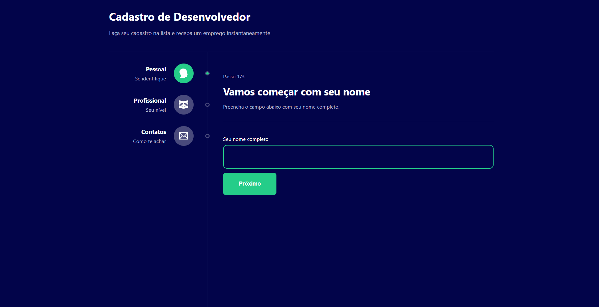

# Formulário Multisteps

Esse projeto é um formulário separado por passos para melhor usabilidade do usuário ao submtê-lo.


Você pode ver o projeto funcionado aqui: [Form-Multistep](https://form-multisteps-dev.vercel.app/)

## Layout




## 🚀 Começando

Pra começar, primeiro clone o repositório do projeto pra sua máquina

```
$ git clone https://github.com/Vinicius-Rubia/Form-Multi-Steps.git
```

## ⚙️ Iniciando o Projeto

Para iniciar, execute os seguintes comandos em seu terminal:

```
$ cd Form-Multi-Steps -> Mudar para o diretório do projeto
```

```
$ npm install -> Instalar todas as dependências

ou então...

$ yarn -> Instalar todas as dependências
```

```
$ npm start -> Iniciar o projeto

ou então...

$ yarn start -> Iniciar o projeto
```

⌨️ com ❤️ por [Vinicius Rubia](https://github.com/Vinicius-Rubia) 😊
